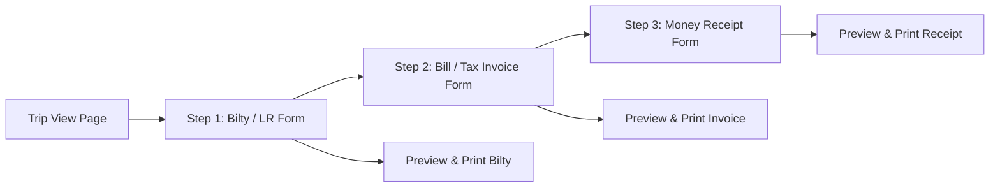
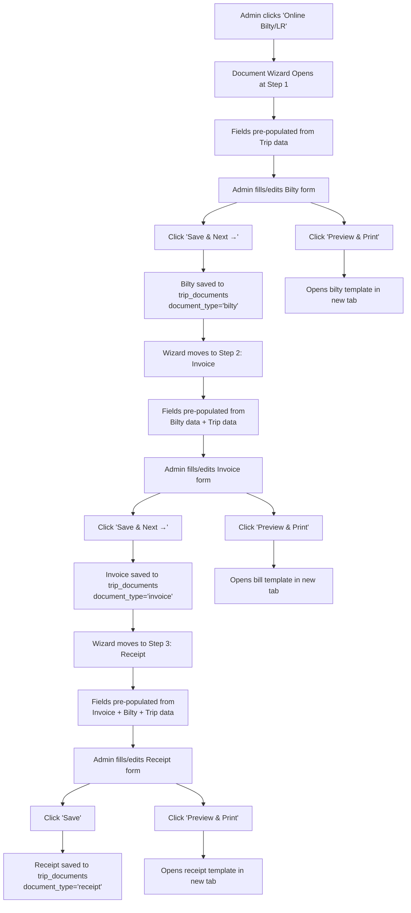

# Invoice & Documents Understanding — Step-by-Step Form Wizard

## 1. Problem Statement

On the **Trip View** page (`view-trip.blade.php`), there are two document actions:

| Button | Current Location | Current Behavior |
|---|---|---|
| **View Bill** | Left panel, action buttons area (line 334–338) | Opens `invoices/{trip_id}` in new tab → renders `admin/bill/template.blade.php` — a **read-only** printable A4 Tax Invoice. Many fields are empty/hardcoded. |
| **Online Bilty/LR** | Right panel, documents section (line 838–841) | Opens `builty/{trip_id}` in new tab → renders `admin/bilty/template.blade.php` — a **read-only** printable A4 Lorry Receipt. Many fields are empty/hardcoded. |

### What's Wrong Today

1. **No Input Forms** — Both templates directly render printable documents. The consignor/consignee details, GST numbers, addresses, freight breakdown, loading/unloading charges, etc. are all **blank or hardcoded** because there's no way for the admin to input them.
2. **No Data Persistence** — Extra document-level data (consignee name, address, GST, description of goods, hamali charges, bilty charges, etc.) is not stored anywhere in the database.
3. **Missing Money Receipt** — There's no Money Receipt document at all, even though it's a standard transport business document for acknowledging payment.
4. **No Sequential Flow** — In real transport operations, documents are generated sequentially: first the LR (when goods are dispatched), then the Invoice (for billing), then the Money Receipt (when payment is received). The current system treats them independently.

---

## 2. Proposed Solution — 3-Step Document Wizard

Redesign the document generation as a **3-step form wizard** accessible from the Trip View page. Each step collects additional inputs, saves to the DB, and generates a printable document.

### Flow Diagram



### Sequential Logic

| Step | Document | When to Use | Pre-requisite |
|---|---|---|---|
| **Step 1** | Bilty / LR (Lorry Receipt) | When goods are dispatched (trip started) | Trip must exist |
| **Step 2** | Bill / Tax Invoice | When billing the party for the trip | Bilty should be created first (recommended, not enforced) |
| **Step 3** | Money Receipt | When payment is received from the party | Invoice should exist; a payment/settlement must be recorded |

> [!NOTE]
> Each step is independent — admin can go back and edit any step. But the natural flow is Bilty → Invoice → Receipt. The wizard UI should guide this sequence.

---

## 3. Step 1 — Bilty / LR Form

### Purpose
Collect consignor/consignee details and goods information to generate the Lorry Receipt.

### Data Sources
Fields are pre-populated from Trip data where available, but the admin can override everything.

### Form Fields

| Field | Source / Default | Editable | Required |
|---|---|---|---|
| **LR Number** | `trip.lr_number` | ✅ | ✅ |
| **LR Date** | `trip.start_date` | ✅ | ✅ |
| **Vehicle No.** | `trip.truck.truck_number` or `trip.truck_name` | ✅ | ✅ |
| **From (Origin)** | `trip.origin` | ✅ | ✅ |
| **To (Destination)** | `trip.destination` | ✅ | ✅ |
| **Consignor Name** | `trip.party.name` or `trip.party_name` | ✅ | ✅ |
| **Consignor Address** | `trip.party.address` | ✅ | ❌ |
| **Consignor Mobile** | `trip.party.mobile` | ✅ | ❌ |
| **Consignor GST No.** | — (new field) | ✅ | ❌ |
| **Consignee Name** | — (new field) | ✅ | ✅ |
| **Consignee Address** | — (new field) | ✅ | ❌ |
| **Consignee Mobile** | — (new field) | ✅ | ❌ |
| **Consignee GST No.** | — (new field) | ✅ | ❌ |
| **GST Paid By** | Dropdown: `Consignor` / `Consignee` | ✅ | ❌ |
| **Invoice No.** | — (manual) | ✅ | ❌ |
| **Description of Goods** | `trip.material_name` | ✅ | ❌ |
| **No. of Packages** | — (new field) | ✅ | ❌ |
| **Actual Weight** | — (new field) | ✅ | ❌ |
| **Charged Weight** | — (new field) | ✅ | ❌ |
| **Freight Amount** | `trip.freight_amount` | ✅ | ✅ |
| **Hamali Charges** | — (new field) | ✅ | ❌ |
| **Bilty Charges** | — (new field) | ✅ | ❌ |
| **Advance Amount** | `trip.advances.sum('amount')` | ✅ | ❌ |
| **E-Way Bill No.** | — (new field) | ✅ | ❌ |
| **Invoice Value** | — (new field) | ✅ | ❌ |
| **Rate** | `trip.per_unit_amount` | ✅ | ❌ |
| **Total Amount** | Auto-calculated | Display only | — |
| **Remark** | `trip.note` | ✅ | ❌ |

### Template Mapping (to existing `admin/bilty/template.blade.php`)

The print preview uses the existing Bilty template design (navy blue theme, A4 portrait) but renders from **saved form data** instead of raw Trip model data.

---

## 4. Step 2 — Bill / Tax Invoice Form

### Purpose
Generate a formal Tax Invoice for the party. Pre-populates from Bilty data (Step 1) where fields overlap.

### Form Fields

| Field | Source / Default | Editable | Required |
|---|---|---|---|
| **Invoice Number** | Auto-generated or manual | ✅ | ✅ |
| **Invoice Date** | Today's date | ✅ | ✅ |
| **Vehicle No.** | From Bilty (Step 1) | ✅ | ✅ |
| **LR No.** | From Bilty (Step 1) | ✅ | ❌ |
| **From** | From Bilty (Step 1) | ✅ | ✅ |
| **To** | From Bilty (Step 1) | ✅ | ✅ |
| **Bill To — Name** | From Bilty consignor (party) | ✅ | ✅ |
| **Bill To — Address** | From Bilty consignor address | ✅ | ❌ |
| **Bill To — GST No.** | From Bilty consignor GST | ✅ | ❌ |
| **Bill To — City / State** | — (new field) | ✅ | ❌ |
| **Bill To — Pin Code** | — (new field) | ✅ | ❌ |
| **Bill From — Name** | Company name (fixed: "N B LOGISTICS") | ✅ | ❌ |
| **Bill From — Address** | Company address (fixed) | ✅ | ❌ |
| **Bill From — GST No.** | — (company GST) | ✅ | ❌ |
| **Bill From — City / State** | — (fixed) | ✅ | ❌ |
| **Bill From — Pin Code** | — (fixed) | ✅ | ❌ |
| **Bill From — Mobile** | — (fixed) | ✅ | ❌ |
| **Ship To — Name** | From Bilty consignee | ✅ | ❌ |
| **Ship To — Address** | From Bilty consignee address | ✅ | ❌ |
| **Ship To — GST No.** | From Bilty consignee GST | ✅ | ❌ |
| **Ship To — City / State** | — (new field) | ✅ | ❌ |
| **Ship To — Pin Code** | — (new field) | ✅ | ❌ |
| **Ship To — Mobile** | From Bilty consignee mobile | ✅ | ❌ |
| **Freight Amount** | `trip.freight_amount` | ✅ | ✅ |
| **Loading Charge** | — (new field) | ✅ | ❌ |
| **Unloading Charge** | — (new field) | ✅ | ❌ |
| **Sub Total** | Auto-calculated (Freight + Loading + Unloading) | Display only | — |
| **SGST %** | — (input %) | ✅ | ❌ |
| **SGST Amount** | Auto-calculated | Display only | — |
| **CGST %** | — (input %) | ✅ | ❌ |
| **CGST Amount** | Auto-calculated | Display only | — |
| **Grand Total** | Auto-calculated (Sub Total + SGST + CGST) | Display only | — |
| **Description of Goods** | From Bilty | ✅ | ❌ |
| **Total Freight in Words** | Auto-generated from Grand Total | Display only | — |
| **Remark** | `trip.note` | ✅ | ❌ |
| **Payment Paid By** | Dropdown: `Cash` / `Cheque` / `UPI` / `Bank Transfer` | ✅ | ❌ |
| **E-Way Bill No.** | From Bilty | ✅ | ❌ |
| **No. of Articles** | From Bilty (packages) | ✅ | ❌ |
| **Total Weight** | From Bilty (actual weight) | ✅ | ❌ |

### Template Mapping (to existing `admin/bill/template.blade.php`)

The print preview uses the existing Bill template design (blue header theme, A4 portrait) but renders from **saved form data**.

---

## 5. Step 3 — Money Receipt Form

### Purpose
Generate a payment acknowledgment receipt when the party makes a payment.

### Form Fields

| Field | Source / Default | Editable | Required |
|---|---|---|---|
| **Receipt Number** | Auto-generated or manual | ✅ | ✅ |
| **Receipt Date** | Today's date | ✅ | ✅ |
| **Received From (M/S)** | Party name (from Invoice) | ✅ | ✅ |
| **Sum of Rupees (words)** | Auto-generated from Net Amount | Display only | — |
| **From** | `trip.origin` | ✅ | ❌ |
| **To** | `trip.destination` | ✅ | ❌ |
| **Freight Amount** | From Invoice | ✅ | ❌ |
| **Loading Charge** | From Invoice | ✅ | ❌ |
| **Unloading Charge** | From Invoice | ✅ | ❌ |
| **Advance Amount** | From Bilty / Trip advances sum | ✅ | ❌ |
| **Net Amount** | Auto-calculated (Freight + Loading + Unloading - Advance) | Display only | — |
| **Paid By — AC Pay** | Amount (input) | ✅ | ❌ |
| **Paid By — By Cash** | Amount (input) | ✅ | ❌ |
| **Cheque No.** | — (manual) | ✅ | ❌ |
| **Cheque Date** | — (manual) | ✅ | ❌ |
| **Bank Name** | — (manual) | ✅ | ❌ |
| **Invoice No.** | From Invoice (Step 2) | ✅ | ❌ |
| **Invoice Date** | From Invoice (Step 2) | ✅ | ❌ |
| **LR No.** | From Bilty (Step 1) | ✅ | ❌ |
| **LR Date** | From Bilty (Step 1) | ✅ | ❌ |
| **Total Packages** | From Bilty | ✅ | ❌ |
| **Received Rs.** | = Net Amount (confirmation display) | Display only | — |

### Template Design
A new printable template (`admin/receipt/template.blade.php`) matching the Money Receipt screenshot — NB Logistics branded, A4/A5 format, navy blue + orange header.

---

## 6. Database Design

### New Table: `trip_documents`

Stores all document data for each trip in a single flexible table.

```
trip_documents
├── id (PK, auto-increment)
├── trip_id (FK → trips.id)
├── document_type (enum: 'bilty', 'invoice', 'receipt')
├── document_number (string, nullable — LR No, Invoice No, Receipt No)
├── document_date (date)
├── data (JSON — all form field values for this document)
├── status (enum: 'draft', 'final' — default: 'draft')
├── created_by (FK → users.id)
├── updated_by (FK → users.id, nullable)
├── created_at
├── updated_at
```

### Why JSON `data` Column?

- Each document type has ~25–35 fields, many of which are unique to that document type.
- Creating separate columns for every field would result in 100+ nullable columns or 3 separate tables.
- The JSON approach is simpler: one table, one query, and the Livewire component casts/validates the JSON structure.
- We can use Laravel's `$casts = ['data' => 'array']` for seamless PHP array access.

### Example JSON Structures

**Bilty (`document_type = 'bilty'`):**
```json
{
    "lr_number": "0073",
    "lr_date": "2026-05-31",
    "vehicle_no": "GJ-03-AB-1234",
    "from": "Jamnagar",
    "to": "Ahmedabad",
    "consignor_name": "ABC Industries",
    "consignor_address": "GIDC Phase-2, Jamnagar",
    "consignor_mobile": "9924328424",
    "consignor_gst": "24AAACB1234F1Z5",
    "consignee_name": "XYZ Traders",
    "consignee_address": "Naroda, Ahmedabad",
    "consignee_mobile": "9876543210",
    "consignee_gst": "24AAACX9876P1Z9",
    "gst_paid_by": "consignor",
    "invoice_no": "INV-001",
    "description_of_goods": "Steel Coils",
    "no_of_packages": 10,
    "actual_weight": "25 MT",
    "charged_weight": "25 MT",
    "freight_amount": 45000,
    "hamali_charges": 500,
    "bilty_charges": 200,
    "advance_amount": 10000,
    "eway_bill_no": "EWB-123456",
    "invoice_value": 500000,
    "rate": 1800,
    "total_amount": 45700,
    "remark": "Handle with care"
}
```

**Invoice (`document_type = 'invoice'`):**
```json
{
    "invoice_number": "NB-INV-2026-001",
    "invoice_date": "2026-05-31",
    "vehicle_no": "GJ-03-AB-1234",
    "lr_no": "0073",
    "from": "Jamnagar",
    "to": "Ahmedabad",
    "bill_to_name": "ABC Industries",
    "bill_to_address": "GIDC Phase-2, Jamnagar",
    "bill_to_gst": "24AAACB1234F1Z5",
    "bill_to_city_state": "Jamnagar, Gujarat",
    "bill_to_pin": "361004",
    "bill_from_name": "N B LOGISTICS",
    "bill_from_address": "Patel Chowk, GIDC Phase-2, Dared, Jamnagar",
    "bill_from_gst": "",
    "bill_from_city_state": "Jamnagar, Gujarat",
    "bill_from_pin": "361004",
    "bill_from_mobile": "9924328424",
    "ship_to_name": "XYZ Traders",
    "ship_to_address": "Naroda, Ahmedabad",
    "ship_to_gst": "24AAACX9876P1Z9",
    "ship_to_city_state": "Ahmedabad, Gujarat",
    "ship_to_pin": "380025",
    "ship_to_mobile": "9876543210",
    "freight_amount": 45000,
    "loading_charge": 500,
    "unloading_charge": 300,
    "sub_total": 45800,
    "sgst_percent": 6,
    "sgst_amount": 2748,
    "cgst_percent": 6,
    "cgst_amount": 2748,
    "grand_total": 51296,
    "description_of_goods": "Steel Coils",
    "total_freight_words": "Fifty One Thousand Two Hundred Ninety Six Rupees Only",
    "remark": "",
    "payment_paid_by": "bank_transfer",
    "eway_bill_no": "EWB-123456",
    "no_of_articles": 10,
    "total_weight": "25 MT"
}
```

**Receipt (`document_type = 'receipt'`):**
```json
{
    "receipt_number": "NB-RCP-2026-001",
    "receipt_date": "2026-06-05",
    "received_from": "ABC Industries",
    "from": "Jamnagar",
    "to": "Ahmedabad",
    "freight_amount": 45000,
    "loading_charge": 500,
    "unloading_charge": 300,
    "advance_amount": 10000,
    "net_amount": 35800,
    "sum_in_words": "Thirty Five Thousand Eight Hundred Rupees Only",
    "ac_pay_amount": 35800,
    "cash_amount": 0,
    "cheque_no": "",
    "cheque_date": "",
    "bank_name": "",
    "invoice_no": "NB-INV-2026-001",
    "invoice_date": "2026-05-31",
    "lr_no": "0073",
    "lr_date": "2026-05-31",
    "total_packages": 10,
    "received_rs": 35800
}
```

---

## 7. Implementation Plan

### Phase 1 — Database & Model

1. **Create Migration** — `create_trip_documents_table.php`
   - Schema as described in Section 6.
2. **Create Model** — `app/Models/TripDocument.php`
   - `$fillable`, `$casts = ['data' => 'array', 'document_date' => 'date']`
   - `belongsTo(Trip::class)`
   - Scopes: `scopeBilty()`, `scopeInvoice()`, `scopeReceipt()`
3. **Update Trip Model** — Add `hasMany(TripDocument::class)` relationship.

---

### Phase 2 — Livewire Component (Wizard)

Create a new Livewire component: `app/Livewire/Admin/Trip/DocumentWizard.php`

**Architecture:**
- This is a **multi-step form** living inside a Bootstrap modal or Offcanvas on the Trip View page.
- Uses a `$currentStep` property (1, 2, or 3) to control which form is shown.
- Each step has its own validation rules and save method.
- Navigation: "Save & Next →", "← Previous", "Save Draft", "Preview & Print".

**Key Properties:**
```php
public int $tripId;
public int $currentStep = 1; // 1=Bilty, 2=Invoice, 3=Receipt

// Step 1 - Bilty fields
public string $lr_number = '';
public string $lr_date = '';
public string $vehicle_no = '';
public string $from = '';
public string $to = '';
public string $consignor_name = '';
public string $consignor_address = '';
public string $consignor_mobile = '';
public string $consignor_gst = '';
public string $consignee_name = '';
public string $consignee_address = '';
public string $consignee_mobile = '';
public string $consignee_gst = '';
public string $gst_paid_by = '';
// ... (all bilty fields)

// Step 2 - Invoice fields
public string $invoice_number = '';
public string $invoice_date = '';
public float $loading_charge = 0;
public float $unloading_charge = 0;
public float $sgst_percent = 0;
public float $cgst_percent = 0;
// ... (all invoice fields, many pre-filled from Step 1)

// Step 3 - Receipt fields
public string $receipt_number = '';
public string $receipt_date = '';
public float $ac_pay_amount = 0;
public float $cash_amount = 0;
// ... (all receipt fields, many pre-filled from Steps 1 & 2)
```

**Key Methods:**
```php
public function mount(int $tripId): void
// Load trip, pre-populate fields from trip data + existing documents

public function goToStep(int $step): void
// Validate current step before proceeding

public function saveBilty(): void
// Validate & save Step 1, creates/updates TripDocument (type=bilty)

public function saveInvoice(): void
// Validate & save Step 2, creates/updates TripDocument (type=invoice)

public function saveReceipt(): void
// Validate & save Step 3, creates/updates TripDocument (type=receipt)

public function previewDocument(string $type): void
// Opens printable template in new tab
```

---

### Phase 3 — Blade Views

#### 3a. Wizard View
`resources/views/livewire/admin/trip/document-wizard.blade.php`

**Layout:**
```
┌──────────────────────────────────────────────────────────┐
│  Step Progress Bar                                       │
│  ┌─────────┐    ┌──────────────┐    ┌──────────────┐    │
│  │ ● Bilty  │───│ ○ Tax Invoice│───│ ○ Money Rcpt │    │
│  └─────────┘    └──────────────┘    └──────────────┘    │
│                                                          │
│  ┌──────────────────────────────────────────────────┐    │
│  │                                                  │    │
│  │  [Form fields for current step]                  │    │
│  │                                                  │    │
│  └──────────────────────────────────────────────────┘    │
│                                                          │
│  [← Previous]  [Save Draft]  [Preview & Print]  [Next →]│
└──────────────────────────────────────────────────────────┘
```

#### 3b. Updated Print Templates
Modify the existing templates to accept the saved `data` JSON from `trip_documents`:

- `resources/views/admin/bilty/template.blade.php` — Update to render from `$document->data` instead of raw `$trip`.
- `resources/views/admin/bill/template.blade.php` — Update to render from `$document->data`.
- **[NEW]** `resources/views/admin/receipt/template.blade.php` — New Money Receipt template matching the screenshot.

---

### Phase 4 — Integration Points

#### 4a. Trip View Page Changes

**"View Bill" button (line 334–338):**
- Change from: `<a href="{{ route('invoices.show', $trip->id) }}" target="_blank">`
- Change to: Opens the Document Wizard modal at Step 2 (Invoice) if a bilty already exists, or at Step 1 if not.

**"Online Bilty/LR" button (line 838–841):**
- Change from: `<a href="{{ route('builty.show', $trip->id) }}" target="_blank">`
- Change to: Opens the Document Wizard modal at Step 1 (Bilty).

#### 4b. Controller Updates

**`BiltyController@show`:**
```php
public function show(string $id)
{
    $trip = Trip::with('party', 'truck', 'driver')->find($id);
    $document = TripDocument::where('trip_id', $id)
                            ->where('document_type', 'bilty')
                            ->first();
    return view('admin.bilty.template', compact('trip', 'document'));
}
```

**`InvoicesController@show`:**
```php
public function show(string $id)
{
    $trip = Trip::with('party', 'truck', 'driver')->find($id);
    $document = TripDocument::where('trip_id', $id)
                            ->where('document_type', 'invoice')
                            ->first();
    return view('admin.bill.template', compact('trip', 'document'));
}
```

**[NEW] `ReceiptController@show`:**
```php
public function show(string $id)
{
    $trip = Trip::find($id);
    $document = TripDocument::where('trip_id', $id)
                            ->where('document_type', 'receipt')
                            ->first();
    return view('admin.receipt.template', compact('trip', 'document'));
}
```

#### 4c. Route Additions

```php
Route::resource('receipts', ReceiptController::class);
```

---

## 8. Data Flow Summary



---

## 9. Field Cascading — How Data Flows Between Steps

| Bilty Field (Step 1) | → Invoice Field (Step 2) | → Receipt Field (Step 3) |
|---|---|---|
| `lr_number` | `lr_no` | `lr_no` |
| `lr_date` | — | `lr_date` |
| `vehicle_no` | `vehicle_no` | — |
| `from` | `from` | `from` |
| `to` | `to` | `to` |
| `consignor_name` | `bill_to_name` | `received_from` |
| `consignor_address` | `bill_to_address` | — |
| `consignor_gst` | `bill_to_gst` | — |
| `consignee_name` | `ship_to_name` | — |
| `consignee_address` | `ship_to_address` | — |
| `consignee_gst` | `ship_to_gst` | — |
| `consignee_mobile` | `ship_to_mobile` | — |
| `freight_amount` | `freight_amount` | `freight_amount` |
| `no_of_packages` | `no_of_articles` | `total_packages` |
| `actual_weight` | `total_weight` | — |
| `eway_bill_no` | `eway_bill_no` | — |
| `advance_amount` | — | `advance_amount` |
| `description_of_goods` | `description_of_goods` | — |
| — | `invoice_number` | `invoice_no` |
| — | `invoice_date` | `invoice_date` |
| — | `loading_charge` | `loading_charge` |
| — | `unloading_charge` | `unloading_charge` |
| — | `grand_total` | `net_amount` (adjusted) |

---

## 10. UI/UX Considerations

### Wizard Placement
- **Option A (Recommended):** Full-page view accessed from Trip View → separate route `/trips/{id}/documents`
- **Option B:** Large Bootstrap Modal (Offcanvas would be too narrow for these forms)

### Step Indicators
- Use a Bootstrap-styled step progress bar showing the 3 steps.
- Completed steps get a green checkmark.
- Current step is highlighted.
- Future steps are greyed out but clickable (if prior step has saved data).

### Pre-population Logic
When the wizard opens:
1. Check if `trip_documents` already has saved data for this trip.
2. If YES → load from DB (editing mode).
3. If NO → pre-populate from Trip model relationships (creation mode).

### Auto-calculations (done in real-time via Livewire)
- **Invoice Sub Total** = Freight + Loading Charge + Unloading Charge
- **SGST Amount** = Sub Total × (SGST% / 100)
- **CGST Amount** = Sub Total × (CGST% / 100)
- **Grand Total** = Sub Total + SGST Amount + CGST Amount
- **Receipt Net Amount** = Freight + Loading + Unloading - Advance
- **Amount in Words** = Helper function to convert number to Indian currency words

### Print Behavior
- "Preview & Print" button saves current step data first, then opens the printable template in a new browser tab.
- The printable templates continue to use `@media print` CSS for clean output.

---

## 11. Files to Create/Modify

### New Files
| File | Purpose |
|---|---|
| `database/migrations/XXXX_create_trip_documents_table.php` | Migration |
| `app/Models/TripDocument.php` | Eloquent model |
| `app/Livewire/Admin/Trip/DocumentWizard.php` | Main wizard component |
| `resources/views/livewire/admin/trip/document-wizard.blade.php` | Wizard blade view |
| `resources/views/admin/receipt/template.blade.php` | Money Receipt printable template |
| `app/Http/Controllers/admin/ReceiptController.php` | Receipt controller |
| `app/Helpers/NumberToWords.php` | Indian currency number-to-words helper |

### Modified Files
| File | Change |
|---|---|
| `app/Models/Trip.php` | Add `hasMany(TripDocument::class)` |
| `routes/web.php` | Add `receipts` resource route, document wizard route |
| `resources/views/livewire/admin/trip/view-trip.blade.php` | Update "View Bill" and "Online Bilty/LR" buttons to open wizard |
| `app/Http/Controllers/admin/BiltyController.php` | Update `show()` to load from `trip_documents` |
| `app/Http/Controllers/admin/InvoicesController.php` | Update `show()` to load from `trip_documents` |
| `resources/views/admin/bilty/template.blade.php` | Update to render from `$document->data` |
| `resources/views/admin/bill/template.blade.php` | Update to render from `$document->data` |

---

## 12. Open Questions

> [!IMPORTANT]
> **Q1:** Should the wizard be a separate full page (`/trips/{id}/documents`) or a large modal on the Trip View page?

> [!IMPORTANT]
> **Q2:** Should each document step be saveable independently (admin can create only a Bilty without being forced to create Invoice and Receipt)? **Recommendation: Yes** — each step saves independently.

> [!NOTE]
> **Q3:** Should we support multiple receipts per trip? (A trip could receive multiple partial payments, each needing a receipt.) **Recommendation: Yes** — one bilty, one invoice, but many receipts.

> [!NOTE]
> **Q4:** Should the company details (N B LOGISTICS address, PAN, bank details) come from a `settings` table for future configurability, or hardcode for now? **Recommendation:** Hardcode for now, move to settings later.

> [!NOTE]
> **Q5:** For the Invoice Number and Receipt Number auto-generation — what format? Examples: `NB-INV-2026-001`, `NB-RCP-2026-001` (year + sequential)?
